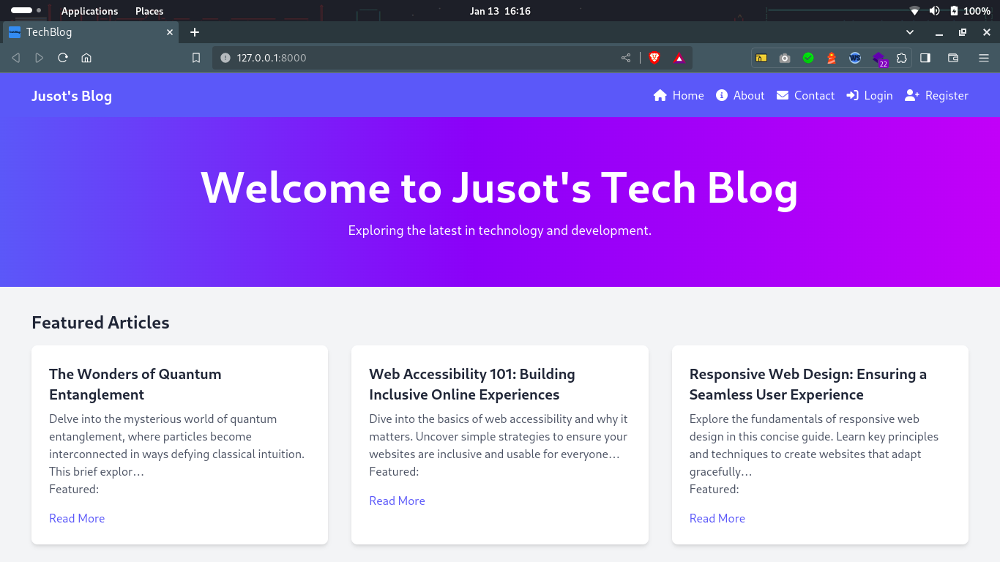
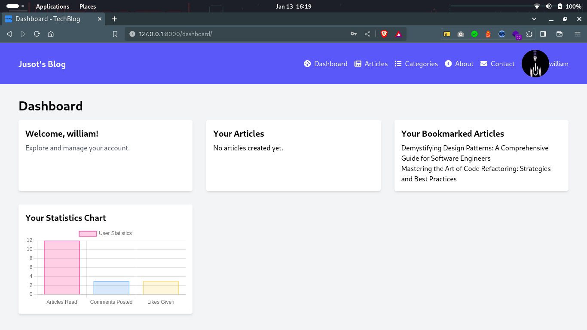

# README.md

# TechBlog - Django Project with MySQL and Tailwind CSS

TechBlog is a Django-powered blog application that uses MySQL as the database and integrates Tailwind CSS for modern styling.

## Objectives

The main objectives of TechBlog are:
- To provide a fully functional blog platform built with Django.
- To integrate MySQL for a robust and scalable database solution.
- To enhance the user interface with modern styling using Tailwind CSS.

## Importance

TechBlog is designed to:
- Showcase best practices in Django development.
- Demonstrate the integration of MySQL as a database backend.
- Illustrate the use of Tailwind CSS for a sleek and responsive design.

## Features

- **User Authentication:** Allow users to register, log in, and manage their profiles.
- **Article Management:** Create, edit, and delete articles with rich text content.
- **Comments:** Enable users to leave comments on articles.
- **Bookmarking:** Users can bookmark articles for later viewing.
- **Social Media Sharing:** Share articles on popular social media platforms.
- **User Notifications:** Notify authors when their articles are read.

## Getting Started

### 1. Create Project Folder

```bash
mkdir Blog
cd Blog
```

## 2. Initialize Virtual Environment (optional but recommended)

```bash
python -m venv .env
source .env/bin/activate
```

## 3. Install Django

```bash
pip install django
```

## 4. Create Django Project and App with mysqlclient for MySQL

```bash
django-admin startproject TechBlog .
python manage.py startapp blog
pip install mysqlclient
```

Make sure to modify "TechBlog" according to the name of your choice.

## 5. Configure Database in `settings.py`

```python

DATABASES = {
    'default': {
        'ENGINE': 'django.db.backends.mysql',
        'NAME': 'your_database_name',
        'USER': 'your_database_user',
        'PASSWORD': 'your_database_password',
        'HOST': 'localhost',
        'PORT': '3306',
    }
}

```

Replace `your_database_name`, `your_database_user`, and `your_database_password` with your MySQL database details.

## 6. Install Tailwind CSS

```bash
pip install django-tailwind # or -> python -m pip install django-tailwind
```

## 7. Configure Tailwind CSS

```bash
python manage.py tailwind init
```

Follow the instructions to create your `tailwind.config.js` configuration file.

*Initialize Tailwind CSS*

```bash
python manage.py tailwind init
```

*Install Tailwind CSS*

```bash
python manage.py tailwind install
```

## 8. Use Tailwind CSS in the Project

In your application, import Tailwind styles into your CSS or SCSS files.

```css
/* Inside your CSS or SCSS file */
@import 'tailwindcss/base';
@import 'tailwindcss/components';
@import 'tailwindcss/utilities';
```

This allows you to use Tailwind CSS in your HTML templates.

Add `'tailwind', 'theme', 'blog'` to your `INSTALLED_APPS` in `settings.py`:

```python
INSTALLED_APPS = [
    # ...
    'tailwind',  # Add this line for Tailwind CSS support
    'theme',  # Add this line for the theme app
    'blog',  # Add this line for the blog app
    # ...
]
```

```bash
# Optional: Configure Django's messaging framework for user feedback
# This line sets the message storage backend to use session-based storage.

MESSAGE_STORAGE = 'django.contrib.messages.storage.session.SessionStorage'
```

*Now, you have configured Tailwind CSS with a theme app and added a blog app to your Django project. You can continue developing your blog app and integrate Tailwind CSS styles as needed.*

Remember to run migrations after making changes to your `INSTALLED_APPS`:

```bash
python manage.py makemigrations
python manage.py migrate
```

*The command `python manage.py tailwind start` likely initiates a Tailwind CSS build process in a Django project using the `tailwindcss` package.*

```bash
python manage.py tailwind start
```

*Configure Tailwind settings in settings.py*

```python
# Inside the TechBlog/settings.py file
TAILWIND_APP_NAME = "theme"
INTERNAL_IPS = [
    "127.0.0.1"
]
```

## 9. Run Development Server

```bash
python manage.py runserver
```

*To access the Django admin panel, create a superuser account using the following command:`python manage.py createsuperuser` Follow the prompts to set up a username, email, and password for the superuser account.*

*Now, Visit http://127.0.0.1:8000/admin/ and log in using the superuser credentials created during setup.*

*Visit http://127.0.0.1:8000/ in your browser to see your Django project with MySQL and Tailwind CSS in action.*

## 10. Progressive Development

Continue developing your project by adding models, views, and features according to your needs.

For more details, refer to the official documentation:
- [Django Documentation](https://docs.djangoproject.com/)
- [Djongo Documentation](https://djongo.readthedocs.io/)
- [Tailwind CSS Documentation](https://tailwindcss.com/docs/installation)

Explore similar blogs and templates:
- **Example Blog:** [Real Python](https://realpython.com/)
- **Bootstrap Themes:** [Bootstrap Themes](https://themes.getbootstrap.com/)
- **Django Blog Example:** [Simpleisbetterthancomplex](https://simpleisbetterthancomplex.com/)

## Screenshots

## Homepage Screenshot

Here's a preview of our homepage. You can see the neat layout, intuitive navigation, and featured articles that grab visitors' attention right from the start.



## Dashboard Screenshot

The dashboard provides a personalized user experience. From managing articles to receiving notifications, everything is accessible at a glance. Explore our advanced features for optimal use.



Feel free to explore additional screenshots in the "screenshots" folder to get a comprehensive view of the platform.

## Authors

- [@jusot99](https://www.github.com/jusot99)

## Badges

[](https://www.djangoproject.com/)

[](https://www.mysql.com/)

[](https://tailwindcss.com/)

[](https://yourprojectlink.com)

[](https://choosealicense.com/licenses/mit/)

[](https://opensource.org/)